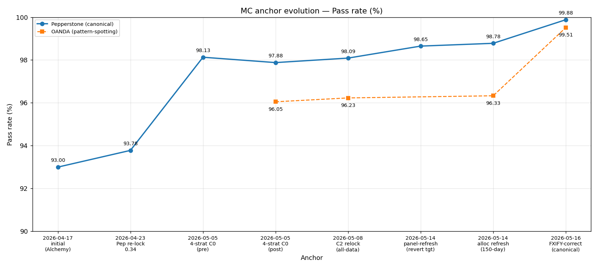
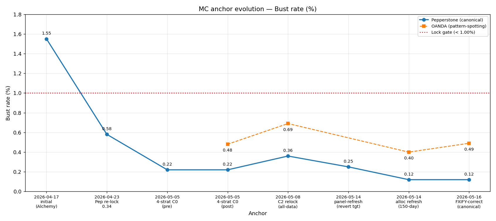
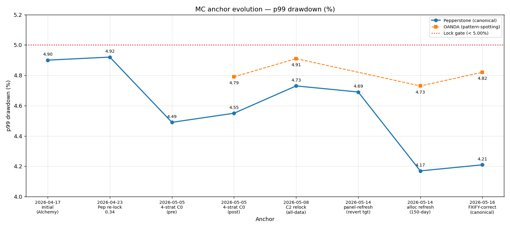
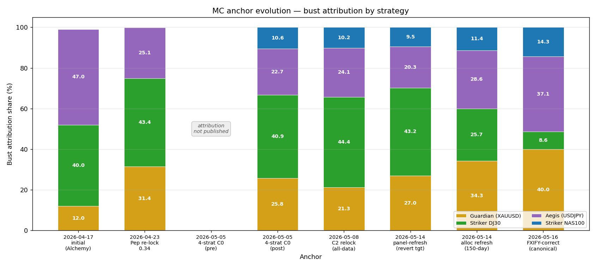

# MC anchor evolution — 2026-04-17 → 2026-05-16

Eight-anchor trajectory of the production portfolio MC lock anchor, with
OANDA pattern-spotting overlay where exports exist. Every number is
cross-checked against the source-of-truth files cited in the per-row
`source` column of [data.csv](data.csv) — not lifted from CLAUDE.md prose.

Reproduce charts: `python docs/analytics/mc_anchor_evolution/plot.py`

## Charts

- 
-  — dashed red gate at `bust < 1.00%`
-  — dashed red gate at `p99 DD < 5.00%`
- 

## Event table

Δ columns are vs the prior Pepperstone anchor on the trajectory.

| # | Date | Anchor | Pass | Bust | p99 DD | Median d-t-p | ΔPass | ΔBust | Δp99 | Source / Trigger |
|---|------|--------|-----:|-----:|-------:|-------------:|------:|------:|-----:|------------------|
| A1 | 2026-04-17 | Initial calibration — Alchemy panel, G 0.30 / S 1.00 / A 1.50, DD 1.0%/0.40× (single-tier post equity-tier-deletion) | 93.00% | 1.55% | ~4.9% | — | — | — | — | [ADR 2026-04-17 dd-trigger calibration](../../adr/2026-04-17-dd-trigger-calibration.md) + [portfolio allocations](../../adr/2026-04-17-portfolio-allocations.md) + [methodology/1r_estimation.md:343](../../methodology/1r_estimation.md) |
| A2 | 2026-04-23 | Pepperstone migration + Guardian risk re-lock 0.30 → 0.34 (committed-panel replay; 3-strat S v4.4 / A v4.3) | 93.78% | 0.58% | 4.92% | 32 | +0.78 pp | −0.97 pp | +0.02 pp | [ADR 2026-04-23 Guardian re-lock 0.34](../../adr/2026-04-23-guardian-risk-relock-0.34.md) + [bust_attribution_flip §Partial-D's](../../briefs/bust_attribution_flip.md) |
| A3 | 2026-05-05 | 4-strategy addition at C0 (DJ30 v4.5 + NAS100 v1 0.40%) — **pre-reconcile transient, 209-trade Guardian** | 98.13% | 0.22% | 4.49% | — | +4.35 pp | −0.36 pp | −0.43 pp | [Q-NAS-3 §Re-anchor note](../../briefs/striker_nas100_q_nas_3_mc_addition.md) — superseded same day by A4 |
| A4 | 2026-05-05 | 4-strategy addition at C0 — **post-reconcile**, 201-trade Guardian (8 phantom v5.5 signals removed) | 97.88% | 0.22% | 4.55% | 23 | −0.25 pp | 0.00 pp | +0.06 pp | [Q-NAS-3 brief](../../briefs/striker_nas100_q_nas_3_mc_addition.md) + [Q-DDP-1 sweep §C0](../../briefs/Q-DDP-1/sweep_results.csv) + `tests/test_mc_anchors.py` (pre-05-08 pin) |
| A5 | 2026-05-08 | dd_protection C2 relock — DD_TRIGGER 0.010 → 0.015 (DD_SCALE held at 0.40), 2022→2026 all-data panel | 98.09% | 0.36% | 4.73% | 22 | +0.21 pp | +0.14 pp | +0.18 pp | [ADR 2026-05-08 C2 relock](../../adr/2026-05-08-dd-trigger-c2-relock.md) + `tests/test_mc_anchors.py` (pre-2026-05-14 pin) + [Q-DDP-1 sweep §C2](../../briefs/Q-DDP-1/sweep_results.csv) |
| A6 | 2026-05-14 | Panel refresh only at C2 — all four Pepperstone CSVs swapped to strict 4yr window (2022-05-14 → 2026-05-14); allocations + Pine params unchanged. **Documented revert target for A7 §Falsifier.** | 98.65% | 0.25% | 4.69% | 21 | +0.56 pp | −0.11 pp | −0.04 pp | [ADR 2026-05-14 allocation refresh §Context + §Alternatives](../../adr/2026-05-14-allocation-refresh.md) |
| A7 | 2026-05-14 | Allocation refresh — DJ30 risk 1.00% → 0.75% + Pine pyramid 350% → 500% (CSV `e3e3d` → `e4dd7`); NAS100 0.40% → 0.45% (CSV `36258` → `da880`). 150-bday horizon-runout semantics — **superseded by A8 on 2026-05-16**. | 98.78% | 0.12% | 4.17% | 21 | +0.13 pp | −0.13 pp | −0.52 pp | [ADR 2026-05-14 allocation refresh §Locked MC](../../adr/2026-05-14-allocation-refresh.md) |
| A8 | 2026-05-16 | **FXIFY-correct timeout semantic — current canonical.** Replaced `portfolio_mc.py`'s 150-bday horizon-runout with 60-bday inactivity bust (matches `firm_rules.py:14`) + 1500-bday safety ceiling. Allocations + dd_protection unchanged from A7. Closes Q-MCTO-1 CLOSED-RESOLVED. | 99.88% | 0.12% | 4.21% | 21 | +1.10 pp | 0.00 pp | +0.04 pp | [ADR 2026-05-16 FXIFY-correct timeout](../../adr/2026-05-16-fxify-correct-timeout-semantic.md) + [`tests/test_mc_anchors.py:94-96`](../../../tests/test_mc_anchors.py) + [Q-MCTO-1 brief](../../briefs/Q-MCTO-1-portfolio-mc-timeout-semantics.md) |

OANDA pattern-spotting overlay (where exports exist; OANDA continues on DJ30 v4.4, no NAS100 panel):

| Date | OANDA anchor | Pass | Bust | p99 DD | Source |
|------|--------------|-----:|-----:|-------:|--------|
| 2026-05-05 → 2026-05-07 | 3-strategy DJ30 v4.4 at C0 (1.0%/0.40×, 150-bday) | 96.05% | 0.48% | 4.79% | [Q-NAS-3 §What is NOT in this MC + §Test pin](../../briefs/striker_nas100_q_nas_3_mc_addition.md) |
| 2026-05-08 → 2026-05-13 | 3-strategy DJ30 v4.4 at C2 (1.5%/0.40×, 150-bday) | 96.23% | 0.69% | 4.91% | [ADR 2026-05-08 §Locked MC](../../adr/2026-05-08-dd-trigger-c2-relock.md) + `tests/test_mc_anchors.py` (pre-2026-05-14 pin) |
| 2026-05-14 → 2026-05-15 | 3-strategy DJ30 v4.4 at C2, allocation refresh (150-bday semantics — superseded 05-16) | 96.33% | 0.40% | 4.73% | [ADR 2026-05-14 §Locked MC](../../adr/2026-05-14-allocation-refresh.md) |
| **2026-05-16 (current)** | 3-strategy DJ30 v4.4 at C2, **FXIFY-correct semantic** | **99.51%** | **0.49%** | **4.82%** | [ADR 2026-05-16 §Locked MC](../../adr/2026-05-16-fxify-correct-timeout-semantic.md) + [`tests/test_mc_anchors.py:115-117`](../../../tests/test_mc_anchors.py) |

## Bust attribution evolution

Pepperstone, percent of busts attributed to each strategy.

| Anchor | Guardian | Striker DJ30 | Aegis (USDJPY) | Striker NAS100 |
|--------|---------:|-------------:|---------------:|---------------:|
| A1 — 2026-04-17 (Alchemy, 3-strat) | ~12% | ~40% | ~47% | — |
| A2 — 2026-04-23 (Pepperstone, 3-strat re-lock) | 31.4% | 43.4% | 25.1% | — |
| A3 — 2026-05-05 pre-reconcile | not separately published | not separately published | not separately published | not separately published |
| A4 — 2026-05-05 post-reconcile (4-strat C0) | 25.8% | 40.9% | 22.7% | 10.6% |
| A5 — 2026-05-08 (4-strat C2 all-data) | 21.3% | 44.4% | 24.1% | 10.2% |
| A6 — 2026-05-14 panel-refresh (revert target) | 27.0% | 43.2% | 20.3% | 9.5% |
| A7 — 2026-05-14 alloc-refresh (150-bday semantics — superseded) | 34.3% | 25.7% | 28.6% | 11.4% |
| A8 — 2026-05-16 FXIFY-correct (current canonical) | 40.0% | 8.6% | 37.1% | 14.3% |

Cross-anchor observations:

1. **A1 → A2 attribution rebalance.** The largest single shift came from the Alchemy → Pepperstone panel migration combined with the Guardian risk re-lock: Aegis ~47% → 25%, Guardian ~12% → 31%, Striker held ~40% → 43%.
2. **A5 → A6 panel roll.** The strict 4yr panel window dropped 2022-01 → 2022-05 data (~7 months of earliest USDJPY weakness rolled off): Aegis 24.1% → 20.3%, Guardian 21.3% → 27.0%. Allocations and dd_protection were held constant — this delta is panel-only.
3. **A6 → A7 allocation-driven rotation.** The DJ30 risk reduction (1.00% → 0.75%) combined with NAS100 bump (0.40% → 0.45%) rotates Striker DJ30 share 43.2% → 25.7% (−17.5 pp). Guardian becomes top contributor at 34.3% — mostly mechanical re-attribution (Guardian bust *count* falls 21 → 12 on 30K sims; share rises because the bust pool shrank 75 → 35). NAS share rises 9.5% → 11.4% on +12.5% allocation — well within the diversification-thesis headroom.
4. **A7 → A8 timeout-semantic re-attribution.** Under the FXIFY-correct semantic, paths that previously hit the 150-bday horizon-runout get an additional ~1350 bdays to resolve. Most pass; some bust later. The composition of those "later" busts is biased toward Striker-class (DJ30 + NAS) early-bust-survivors that eventually succumb under a longer horizon. Net: Striker DJ30 share collapses 25.7% → 8.6%; Guardian + Aegis + NAS each absorb share. Total bust count unchanged at 35 across 30K sims; only the per-strategy composition moves.

## Lock-criteria gates across the trajectory

| Anchor | Bust < 1.00% | p99 DD < 5.00% |
|--------|:-------------:|:---------------:|
| A1 (Alchemy, 04-17) | ✗ (1.55%) | ✓ (~4.9%) — within rounding of gate |
| A2 (Pep re-lock 04-23) | ✓ (0.58%) | ✓ (4.92%) — thin margin |
| A3 (4-strat C0 pre) | ✓ (0.22%) | ✓ (4.49%) |
| A4 (4-strat C0 post) | ✓ (0.22%) | ✓ (4.55%) |
| A5 (4-strat C2 all-data) | ✓ (0.36%) | ✓ (4.73%) |
| A6 (panel-refresh revert tgt) | ✓ (0.25%) | ✓ (4.69%) |
| A7 (alloc-refresh 150-bday — superseded) | ✓ (0.12%) | ✓ (4.17%) |
| **A8 (FXIFY-correct current canonical)** | **✓ (0.12%)** | **✓ (4.21%) — widest margin on record** |

ADR 2026-05-16 §Consequences pins A8 as "both lock gates pass with the widest margin on record" (bust 88pp margin under 1% ceiling; p99 DD 16pp margin under 5% ceiling). A7 → A8 holds bust rate identical at 0.12%; the +1.10pp pass-rate shift comes from ex-"timeout" paths now resolving as passes.

OANDA at O8 (current canonical) clears both gates with thinner margin than Pepperstone (0.49% bust / 4.82% p99 DD), consistent with OANDA's documented secondary pattern-spotting role per the two-tier canonical rule. OANDA had only the DJ30 risk reduction propagate at A7/O7 (no NAS panel); the FXIFY-correct semantic at O8 shifts pass +3.18pp on the same underlying OANDA panel.

## Excluded by design

- **2026-04-20 Alchemy reference (99.21% pass / 0.03% bust).** Different model class (Striker v4.4 + Aegis v4.2 era reference baseline, not a locked-config MC anchor) — would mis-frame the trajectory. Source: [CLAUDE.md §Strategy Reference](../../../CLAUDE.md), strategies/{guardian,striker,aegis}/*_CHANGELOG.md.
- **2026-04-23 in-flight panel (92.73% pass / 0.65% bust / 4.94% p99 DD).** The 04-23 lock-decision used this in-flight panel which was not committed. The trajectory uses the committed-panel replay (93.78% / 0.58% / 4.92%) for code-reproducibility. The in-flight figures are preserved in [ADR 2026-04-23 §Locked MC numbers](../../adr/2026-04-23-guardian-risk-relock-0.34.md).

Footer note: ADR 2026-04-23 reports 92.73% pass / 0.65% bust / 4.94% p99 DD against the in-flight panel; CLAUDE.md and this trajectory cite 93.78% / 0.58% / 4.92% from the committed-panel replay reported in bust_attribution_flip §Partial-D's. The deltas are panel-revision-only (no allocation, version, or dd_protection constant moved between 04-23 and 04-26 — verified by per-commit diff inspection in the bust_attribution_flip brief §Panel-revision noise floor).

## Notes on individual data points

- **A1 p99 DD = "~4.9%".** ADRs 2026-04-17-dd-trigger-calibration §Decision and 2026-04-17-equity-tier-deletion §Alternatives both report this as "~4.9%" (not pinned to a specific decimal). The 4.9% value is used for chart plotting; the trajectory framing does not depend on the trailing digit.
- **A3 attribution not published.** The pre-reconcile 209-trade panel was superseded same-day by the 201-trade reconcile (8 phantom v5.5 signals from a Pine recompile / cache artefact removed). Bust attribution was not separately captured before the re-export.
- **A5 → A6 panel-shape change.** A1–A5 all use the 2022-01-04 → 2026-04-20 panel (1120 bdays / 223 week-blocks). A6 + A7 use the strict 4yr 2022-05-23 → 2026-05-14 panel (1039 bdays / 207 week-blocks) — defined by Aegis's 2022-07-18 first signal under a 100d `assert_window` tolerance (loosened 60d → 100d during the panel refresh).
- **A7 Pine pyramid 350% → 500%.** This is a Pine-source parameter change, not pure operational-layer. ADR 2026-05-14 §Consequences explicitly documents the breach of CLAUDE.md "Key Principle: it never touches strategy parameters". Version tag retained as v4.5; future audit may require v4.6 bump.
- **A7 → A8 same allocations + dd_protection.** Only the timeout semantic changes between A7 and A8. Allocations (G 0.34% / DJ30 0.75% pyr 500% / A 1.50% / NAS 0.45%), dd_protection C2 (0.015 / 0.40), and panel (1039 bdays / 207 week-blocks) are identical. The +1.10pp pass-rate shift comes from `portfolio_mc._simulate_path`'s outcome bucketing: ex-`timeout` paths (paths that didn't bust within 150 bdays but hadn't yet hit +5%) now extend up to HORIZON_CAP=1500 bdays and most reach +5%. A small fraction bust later — Pepperstone bust count unchanged at 35; OANDA bust count rose slightly (0.40% → 0.49%).
- **OANDA between 04-26 and 05-05.** Earlier OANDA anchors not plotted (the canonical-OANDA migration on 2026-04-26 produced attribution data but not load-bearing headline pass/bust/DD numbers; see bust_attribution_flip §Context).

## Cross-references

- [ADR 2026-04-17 dd-trigger calibration](../../adr/2026-04-17-dd-trigger-calibration.md)
- [ADR 2026-04-17 equity-tier deletion](../../adr/2026-04-17-equity-tier-deletion.md)
- [ADR 2026-04-17 portfolio allocations](../../adr/2026-04-17-portfolio-allocations.md)
- [ADR 2026-04-23 Guardian risk re-lock 0.34](../../adr/2026-04-23-guardian-risk-relock-0.34.md)
- [ADR 2026-05-08 dd-trigger C2 relock](../../adr/2026-05-08-dd-trigger-c2-relock.md)
- [ADR 2026-05-14 allocation refresh](../../adr/2026-05-14-allocation-refresh.md)
- [ADR 2026-05-16 FXIFY-correct timeout semantic](../../adr/2026-05-16-fxify-correct-timeout-semantic.md) **(current canonical)**
- [Q-NAS-3 — 4-strategy MC addition](../../briefs/striker_nas100_q_nas_3_mc_addition.md)
- [Q-DDP-1 — recommendation](../../briefs/Q-DDP-1/recommendation.md), [sweep_results.csv](../../briefs/Q-DDP-1/sweep_results.csv)
- [Q-MCTO-1 — portfolio_mc timeout semantics](../../briefs/Q-MCTO-1-portfolio-mc-timeout-semantics.md) — **CLOSED-RESOLVED 2026-05-16**
- [bust_attribution_flip](../../briefs/bust_attribution_flip.md) — closed broker-feed-confirmed 2026-05-08
- [`tests/test_mc_anchors.py`](../../../tests/test_mc_anchors.py) — current canonical pins
- [`portfolio_mc.py`](../../../portfolio_mc.py) — reproduction harness
- [CLAUDE.md §Strategy Reference + §Protection](../../../CLAUDE.md) — canonical narrative
