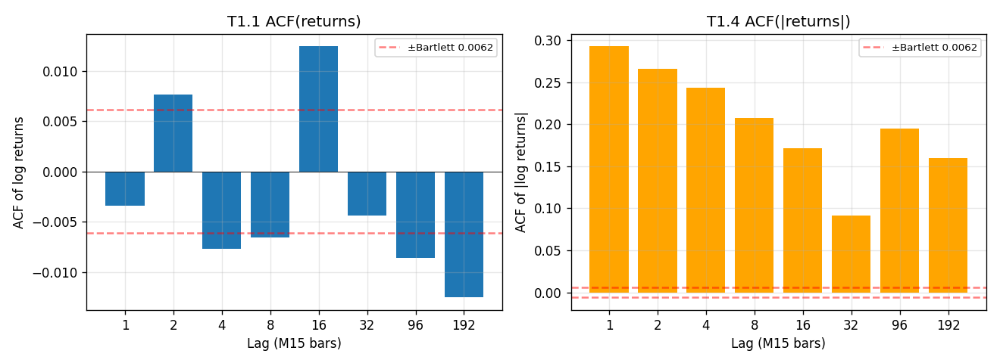
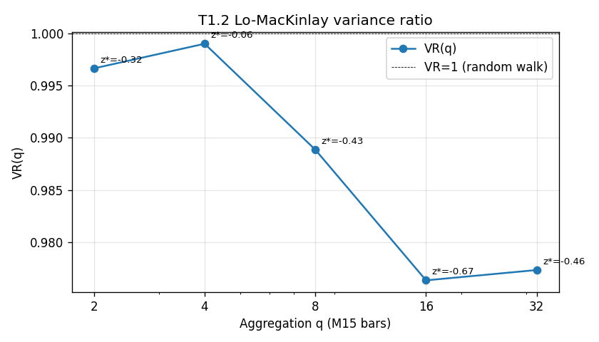
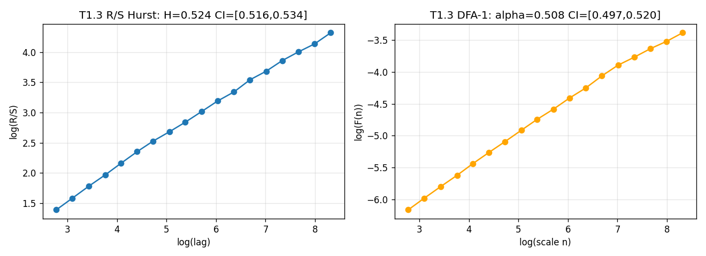
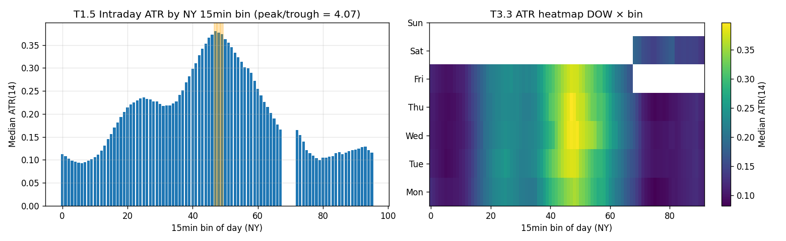
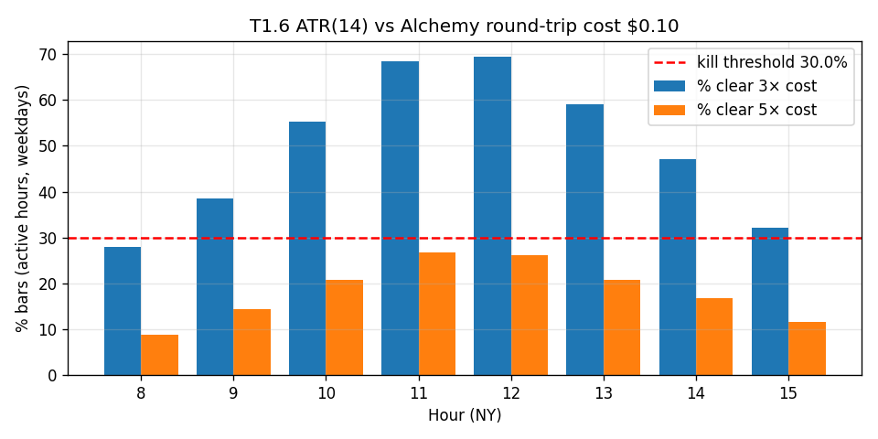
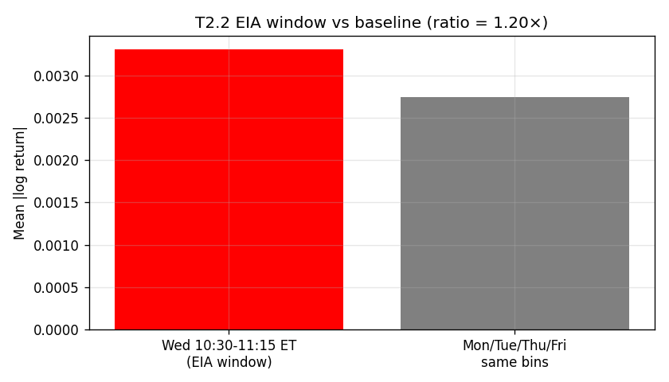

# USOIL M15 — behavioral characterization (Phase 1)

**Verdict:** vol-gated

USOIL 15min has volatility-clustering structure (ACF on |returns| significant, intraday concentration) but no clear directional edge in raw returns. A vol-gated strategy archetype is suggested for the Inquire phase.

**Verdict rationale (per §5 decision matrix):**
- ACF(1)=-0.003 weak; ACF|r|(1)=0.293>0.10; intraday peak/trough=4.07>1.5

**Loop:** USOIL 15min behavioral characterization (2026-05-02), Notice/Identify phase
**Plan:** `~/.claude/plans/usoil-15min-behavioral-composed-tower.md`
**Brief:** user-supplied scope brief 2026-05-02 (USOIL 15min behavioral characterization)

## 1. Provenance

- **Data:** `data/bar_data/USOIL_oanda_m15_2022-01-04_to_2026-04-20_clean.csv`
- **SHA256:** `7bd2867e8d9bad9c8892709cb3fd9bd0672d42bd16977f858f5b2ce7b527b905`
- **N bars:** 101,305  N returns (excl maintenance): 101,304
- **Window:** 2022-01-04 00:00:00+00:00 -> 2026-04-19 23:45:00+00:00
- **Source:** OANDA practice endpoint (`WTICO_USD`, mid pricing, M15)
- **Pipeline:** `archive/analysis/usoil/phase1_characterize.py`
- **Raw results:** `2026-05-02_usoil_phase1_results.json`
- **Stage 0 reconciliation:** `2026-05-02_usoil_feed_reconciliation.md` (must pass before Phase 1)

- **Alchemy DXTrade USOIL cost reference (placeholder — verify):**
  - spread: $0.0500/bbl
  - commission: $0.0000/bbl
  - round-trip cost: $0.1000/bbl

## 2. Tier-1 results

| Stat | Value | CI / sig | Decision-relevant? |
|---|---:|---|---|
| T1.1 ACF(returns) lag 1 | -0.0034 | Bartlett ±0.0062; bootstrap [-0.0197, 0.0164] | yes — directional persistence at 15min |
| T1.1 ACF(returns) lag 4 | -0.0077 | Bartlett ±0.0062 | yes — 1h horizon |
| T1.1 ACF(returns) lag 96 | -0.0086 | Bartlett ±0.0062 | yes — 1-day horizon |
| T1.2 VR(8) | 0.9889 | z*=-0.426 p=0.6704 | yes — 2h aggregation |
| T1.2 VR(32) | 0.9773 | z*=-0.458 p=0.6471 | yes — 8h aggregation |
| T1.3 Hurst R/S | 0.5245 | CI95 [0.516, 0.534] (width 0.018) | yes |
| T1.3 Hurst DFA-1 | 0.5081 | CI95 [0.497, 0.520] (width 0.023) | yes |
| T1.3 estimator difference | 0.0163 | max CI width 0.0229; needs joint review = **False** | yes — replaces hard 0.10 threshold per plan |
| T1.4 ACF(|returns|) lag 1 | 0.2926 | Bartlett ±0.0062 | yes — vol clustering |
| T1.4 ACF(|returns|) lag 96 | 0.1944 | Bartlett ±0.0062 | yes — daily vol cycle |
| T1.5 intraday ATR top-3 bins (NY) | [47, 48, 49] | peak/trough ratio 4.07 | yes — vol concentration |
| T1.6 cost floor: % bars > 3× cost (active hrs) | 49.79% | kill if < 30.0%; **PASS** | yes — abort gate |

## 3. Tier-2 — refines the picture

### T2.1 Variance by DOW

| DOW | n | Var(log_ret) | CI95 |
|---|---:|---:|---|
| Mon | 20,041 | 7.91e-06 | [6.72e-06, 9.44e-06] |
| Tue | 20,537 | 7.13e-06 | [6.55e-06, 7.75e-06] |
| Wed | 20,399 | 6.82e-06 | [6.35e-06, 7.39e-06] |
| Thu | 20,277 | 6.34e-06 | [6.00e-06, 6.68e-06] |
| Fri | 14,799 | 6.79e-06 | [6.36e-06, 7.42e-06] |
| Sat | 0 | n/a | underpowered (n=0<30) |
| Sun | 5,251 | 1.91e-05 | [8.79e-06, 3.22e-05] |

### T2.2 EIA event study (Wed 10:30–11:15 ET, 4 bars)

- EIA bars n = 888
- Mon/Tue/Thu/Fri same-bin baseline n = 3532
- Mean |log ret| EIA = 0.00330, baseline = 0.00274
- **Ratio EIA / baseline = 1.20×**
- EIA bootstrap CI95 = [0.00310, 0.00349]

### T2.3 Vol expansion (low-vol → next-bar |r|)

- Low-vol → not-low transitions: n = 34,631
- Next-bar |r| mean (post-transition) = 0.00114
- Unconditional |r| mean = 0.00160
- **Ratio next/uncond = 0.710**
- Next-bar CI95 = [0.00112, 0.00117]

### T2.4 Body/range ratio (top-quartile |r| vs unconditional)

- Unconditional median body/range = 0.467
- Top-quartile |r| (n=25,326) median body/range = 0.705
- Top-quartile threshold (q75 |log ret|) = 0.00205

## 4. Tier-3 — informative but not decision-critical

- T3.1 Excess kurtosis = 248.87
  - Weekly variance share: top-1 bar = 10.40%, top-5 = 24.60%, top-20 = 47.16%
- T3.2 Daily 3σ events: n = 18 of 1334 days (daily σ = 0.0240)
  - **Small-cell warning** (Rule 1): n = 18 < 30; tail-event statistics carry the small-cell prior

## 5. Plots

- T1.1 + T1.4 ACF: 
- T1.2 Variance ratio: 
- T1.3 Hurst (R/S + DFA): 
- T1.5 + T3.3 Intraday ATR + DOW heatmap: 
- T1.6 Cost floor: 
- T2.2 EIA event: 

## 6. Pre-Q gate audit trail

**Permitted deletions applied:**
- D1: maintenance-window bars (CME Globex 17:00-17:45 ET, Mon-Fri) — TAGGED, retained, excluded only from return-distribution stats. D-test: known measurement artefact. Permitted.

**Permitted deletions considered and rejected:**
- D2: Stage 0 quantitative feed-reconciliation deletion. Considered during plan clarification 2026-05-02; rejected by Joshua. Stage 0 was restored as a hard precondition. The 'we'll catch it in Phase 2' framing was identified as silent substitution and rejected.

**Forbidden D-tests not applied** (committed in plan §Pre-Q gate):
- 'known fundamental driver?' — not asked
- 'matches Striker breakout pattern?' — not asked
- 'autocorrelation high enough to be useful?' — not asked
- 'copper or Brent shown similar?' — not asked

## 7. Recommended next Q (Inquire-phase seed)

**Q-USOIL-3**: Conditional on USOIL 15min volatility-gated structure (ACF|r|>0.10, intraday concentration), separate the vol-gate from the underlying directional edge. What direction (if any) does USOIL exhibit conditional on entering a top-3 ATR-percentile bin?

## 8. Risks and caveats

- **Alchemy cost is a placeholder.** The T1.6 verdict depends on the round-trip cost assumption. Joshua to verify against current DXTrade USOIL spread before locking the verdict; a 2× cost increase (e.g. $0.10 round-trip becoming $0.20) materially shrinks the % bars clearing 3× cost and could flip T1.6 from PASS to KILL. Re-run with corrected cost if needed.
- **OANDA practice feed.** The 52-month panel is OANDA practice. Phase 2 visual on Pepperstone TV is the broker-equivalence check (see plan Stage D pre-registered criteria).
- **CFD synthetic.** OANDA WTICO_USD is a CFD; not the underlying CME front-month WTI. Stage 0 reconciliation against Pepperstone CFD addresses inter-broker drift but not CFD-vs-future drift.
- **Hurst estimator stability.** If R/S and DFA disagree by more than the bootstrap CI width (`needs_joint_review` flag in T1.3), the verdict's reliance on H is weakened — see plan stop conditions.
- **Maintenance-window detection is clock-time only.** OANDA's CFD feed may or may not honor the underlying CME settlement halt; the tag is conservative and may over-flag.

## 9. Cross-references

- Plan: `~/.claude/plans/usoil-15min-behavioral-composed-tower.md`
- Stage 0 reconciliation: `2026-05-02_usoil_feed_reconciliation.md`
- Phase 2 validation (downstream): `2026-05-02_usoil_phase2_validation.md`
- Brief format precedent: `archive/docs/methodology/archive/findings/2026-04-26_audnzd_structural_characterization.md`
- Hurst log-prices trap memory: `feedback_hurst_rs_log_prices_trap.md`
- Observation routing: `docs/methodology/observation_routing.md`
