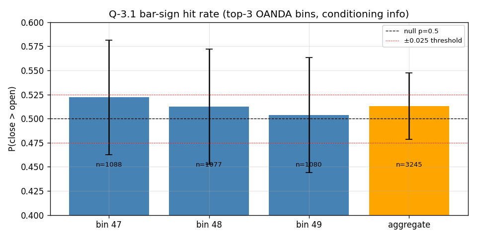
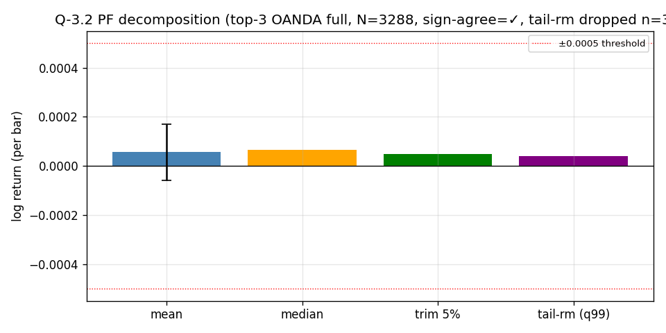
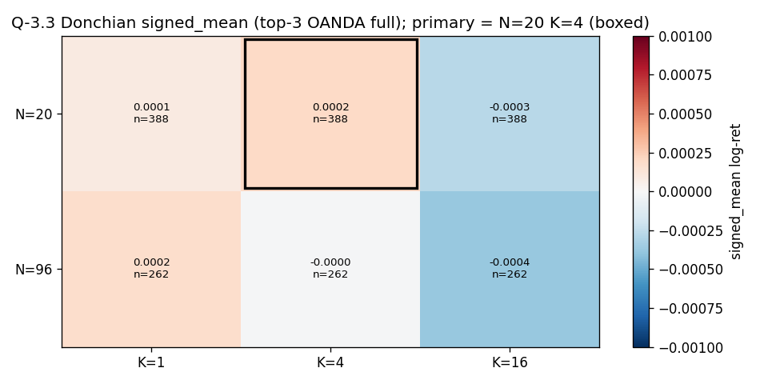
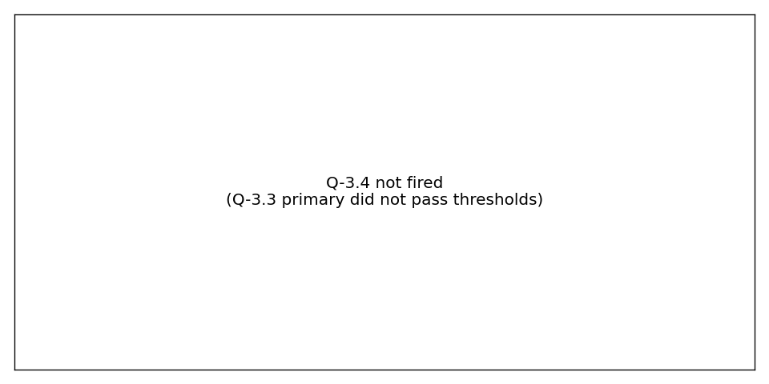

# USOIL M15 — Q-USOIL-3 directional edge (Phase 3)

**Verdict:** **Closed — no directional edge in OANDA M15 2022–2026 conditional on the vol-gate.**

USOIL 15min volatility-clustering structure (Phase 1 verdict `vol-gated`) is real but **carries no first-moment or breakout-aligned forward-return edge** at any pre-registered cell. Phase 1 + Phase 3 jointly: the top-3 ATR bins (11:30–12:15 ET) are a vol concentration without an exploitable directional signature — neither bar-sign, nor mean log-return, nor Donchian breakout follow-through clears its pre-registered effect-size threshold or block-bootstrap p<0.05 floor.

**Loop:** USOIL 15min behavioral characterization (2026-05-02), Phase 3 — Inquire phase
**Plan:** [`~/.claude/plans/q-usoil-3-conditional-on-usoil-dynamic-turtle.md`](../../../../.claude/plans/q-usoil-3-conditional-on-usoil-dynamic-turtle.md)
**Pipeline:** [analysis/usoil/phase3_directional.py](../../../analysis/usoil/phase3_directional.py)
**Routing:** [docs/methodology/observation_routing.md](../observation_routing.md) (three-bucket gate). Q-USOIL-3 routes **Closed** (cheapest-falsification result clears the question; no Pepperstone validation leg required).
**D-S-A domain:** data + system. Strategy code, allocations, dd_protection, MC calibration untouched.

## 1. Pre-Q gate (frozen before first statistic computed)

**D — permitted deletions applied:**

- **D1**: maintenance-window bars (`is_maintenance == True`). Match Phase 1; known measurement artefact (CME settlement halt). *Note:* the clean.csv currently has 0 bars flagged maintenance — D1 is a no-op on this dataset, but pre-registered for forward compatibility.
- **D2**: holiday-shortened sessions (`is_holiday_short == True`). 2,119 bars excluded. Reduced participation distorts the conditional distribution.
- **D3**: Sunday bars. 5,251 bars excluded (Phase 1 §T2.1 DST/open-spike artefact).
- **D4**: ATR(14) warmup (first 14 bars). Indicator warmup, not a real measurement.

**D — forbidden D-tests committed not to apply:**

- "Matches Striker DJ30 breakout (`breakoutBars=15`)?" — pre-registered N=20 used, not 15.
- "Brent / Copper shows similar?" — cross-instrument consistency is not a falsification criterion.
- "Autocorrelation high enough to be useful?" — replaced by pre-registered effect-size thresholds.
- "Would this be a 4th-strategy candidate?" — strategy design, downstream of this Q.

**S:** condition on the OANDA top-3 set `[47, 48, 49]` (load-bearing object from Phase 1, loaded from JSON, not re-derived). Sensitivity row reported on the Pepperstone-overlap subset `[47, 48]`.

**A:** single-pass dataframe; all cells derive from one `is_top3 ∧ cohort_eligible` mask plus rolling Donchian and forward-return columns.

## 2. Provenance

- **Data:** [data/bar_data/USOIL_oanda_m15_2022-01-04_to_2026-04-20_clean.csv](../../../data/bar_data/USOIL_oanda_m15_2022-01-04_to_2026-04-20_clean.csv)
- **SHA256:** `7bd2867e8d9bad9c8892709cb3fd9bd0672d42bd16977f858f5b2ce7b527b905` (matches Phase 1)
- **N bars total:** 101,305
- **N cohort (top-3 OANDA full):** 3,288
- **N cohort (Pepperstone overlap [47, 48]):** 2,192
- **Cohort σ (1-bar log-ret):** 0.00310
- **Cohort σ (next-1-bar):** 0.00322 — **Cohort σ (next-4-bar):** 0.00640 — **Cohort σ (next-16-bar):** 0.01070
- **Source:** OANDA practice endpoint (`WTICO_USD`, mid pricing, M15)
- **Pre-step verification:** measured cohort σ matches plan back-of-envelope (0.0035) to within 12%. Pre-registered effect-size thresholds (5e-4, 1e-3) retained; cohort-SE separation reported alongside.
- **Raw results:** [`2026-05-02_usoil_phase3_results.json`](2026-05-02_usoil_phase3_results.json)

## 3. Tier-1 results (primary path)

### Q-3.1 — Bar-sign hit rate (conditioning, not voting)

| Cohort | N | n_up | n_down | n_flat | p̂(up) | 95% CI | p (two-sided) | \|diff−0.5\| | passes 0.025 threshold |
|---|---:|---:|---:|---:|---:|---|---:|---:|---:|
| top-3 OANDA full | 3,288 | 1,664 | 1,581 | 43 | 0.5128 | [0.4784, 0.5472] | 0.150 | 0.0128 | **No** |
| Pepperstone overlap [47, 48] | 2,192 | 1,120 | 1,045 | 27 | 0.5173 | [0.4752, 0.5594] | 0.112 | 0.0173 | **No** |

Result: |p̂ − 0.5| = 0.013 (full) and 0.017 (overlap) — both inside the noise floor and below the 0.025 economic-meaning threshold. **No first-moment bar-sign edge.**

### Q-3.2 — Mean log-return + PF decomposition (conditioning, not voting)

| Cohort | N | mean | median | trim 5% | tail-rm (q99) | tail dropped | mean CI95 (block=4) | p (block=4) | sign-agree | passes 5e-4 |
|---|---:|---:|---:|---:|---:|---:|---|---:|---:|---:|
| top-3 OANDA full | 3,288 | 5.7e-5 | 6.7e-5 | 4.8e-5 | 4.1e-5 | 33 | [−6.0e-5, 1.7e-4] | 0.322 | ✓ | **No** |
| Pepperstone overlap | 2,192 | 7.6e-5 | 8.2e-5 | 6.4e-5 | 4.1e-5 | 22 | [−5.7e-5, 2.2e-4] | 0.264 | ✓ | **No** |

All four estimators agree on sign (positive) but **|mean| < 5e-4 threshold by an order of magnitude**, and the block-bootstrap CI on the mean straddles zero. **No magnitude-aware first-moment edge.**

### Q-3.3 — Donchian breakout follow-through (PRIMARY: N=20, K=4)

| | Primary | Pep overlap |
|---|---:|---:|
| N events | 388 | 266 |
| n long-break | 217 | 149 |
| n short-break | 171 | 117 |
| Breakout rate | 11.8% | 12.1% |
| signed_mean | 2.03e-4 | 2.0e-4 |
| signed SE | 3.08e-4 | 3.4e-4 |
| **cohort-SE separation** | **0.66σ** | 0.59σ |
| p (block=4) | **0.456** | 0.598 |
| sign-agreement (mean / median / trim / tail-rm) | ✓ | ✓ |
| CI sweep (blocks 1/4/16) widths disagree >50% | ✗ (stable) | ✗ |
| passes 1e-3 threshold | **No** | No |
| passes p < 0.05 | **No** | No |
| passes 3.0σ promotion floor | **No** | No |

**Primary cell fails all three pass criteria.** N_3.3 = 388 is comfortably in the `expected_n` band (>350, plan §3 marginal-pass cutoff), so this is a clean primary fail rather than a marginal-N artefact. The PF decomposition's sign-agreement is preserved (mean +2.0e-4, median +2.7e-4) but tail-rm collapses to 2.8e-6 — i.e. the small positive aggregate is partially tail-influenced; nothing economically meaningful survives the decomposition.

### Sensitivity — bin 49 (OANDA-only) excluded

The Pepperstone-overlap row in §3.1, §3.2, §3.3 is the bin-49-excluded sensitivity. **Same conclusion at every cell.** Bin 49 is not a load-bearing source of (absent) signal.

## 4. Tier-2 — secondary Donchian cells (robustness)

| Cohort | N | K | signed_mean | separation | p (block=4) | passes thresholds |
|---|---:|---:|---:|---:|---:|---:|
| full | 20 | 1 | 9.2e-5 | 0.44σ | 0.530 | No |
| full | 20 | **4** (primary) | 2.03e-4 | 0.66σ | 0.456 | No |
| full | 20 | 16 | −2.83e-4 | 0.61σ | 0.624 | No |
| full | 96 | 1 | 1.78e-4 | 0.68σ | 0.464 | No |
| full | 96 | 4 | −9e-6 | 0.02σ | 0.950 | No |
| full | 96 | 16 | −3.81e-4 | 0.68σ | 0.644 | No |

No secondary cell crosses any pre-registered threshold. **No "secondary-only suggestive" route is available** — the line routes Closed cleanly, not Forward-not-promoted.

Cross-cell sign pattern is mixed (K=1 / K=4 lean positive at N=20; K=16 leans negative; N=96 K=4 is essentially zero) — no consistent direction across windows that would suggest a subtler edge that the primary cell misses.

## 5. Q-3.4 — DOW gate (NOT FIRED)

Q-3.3 primary did not pass thresholds, so the DOW gate did not fire. Per plan §3 Q-3.4, the gate exists to defend against the OANDA DOW feed-artifact failure mode (provenance: [`feedback_oanda_dow_feed_artifact.md`](../../../../../../.claude/projects/C--Users-joshu-prop-firm-pipeline/memory/feedback_oanda_dow_feed_artifact.md); 2026-05-02 Stage 2 closures of OANDA-only DOW candidates rejected at Pepperstone, commits `93b3c80`, `2de9e2c`). Since no candidate signal exists, no artifact gating is needed.

**EIA Wednesday confound (named in plan §Risks):** EIA crude inventory release at Wed 10:30 ET is the most likely confound source for any candidate edge in the 11:30–12:15 ET window. The DOW gate is the structural test for it — a Wed-only signal would have failed the ≥3-of-5 same-sign requirement and routed Closed under the DOW feed-artifact branch. Since no aggregate edge appears, the EIA-confound discussion is moot in this loop.

## 6. Plots

- Q-3.1: 
- Q-3.2: 
- Q-3.3:  (primary cell N=20 K=4 boxed)
- Q-3.4: 

## 7. Decision tree — branch traversed

```
Q-3.1, Q-3.2 → reported as conditioning (do not gate) ✓
Q-3.3 primary (N=20, K=4)
└── fails primary, no secondary signal → CLOSED  ← TRAVERSED
                                          ("vol-gated structure has no
                                            directional edge in OANDA M15
                                            2022–2026")
```

No marginal-pass band engaged (N=388 > 350). No DOW gate engaged (Q-3.3 did not pass). No Pepperstone Pine validation leg required (Q-3.3 did not promote).

## 8. Composite finding (Phase 1 + Phase 3)

Phase 1 found:
- ACF on returns at lag 1 weak (−0.003)
- VR(8) random-walk consistent (p=0.67)
- Hurst R/S 0.524 / DFA 0.508 — no long-memory
- ACF on |returns| strong (0.293) — vol clustering
- Intraday ATR peak/trough 4.07× concentrated 11:30–12:15 ET

Phase 3 adds: **the vol cluster also has no non-linear (Donchian-conditioned) directional structure** at the pre-registered cells. The conjunction is a stronger "no edge" than Phase 1 alone — this is the kind of structure that doesn't show up in linear ACF *and could in principle exist* under a turtle-style breakout filter, but does not in this sample. USOIL M15 in 2022–2026 is a **directionless vol-gated instrument** at this timeframe and broker.

## 9. What this rules out (for routing future Qs)

- A turtle-archetype strategy on USOIL M15 conditional on the vol cluster is unlikely to produce a tradeable edge — both N=20 and N=96 priors fail across K ∈ {1, 4, 16}.
- A simple bar-sign or mean-aware first-moment edge in the 11:30–12:15 ET window does not exist at this sample.
- Bin 49 (OANDA-only) does not carry hidden signal — the overlap-subset sensitivity says the OANDA-Pepperstone bin disagreement at bin 49 vs bin 46 is not load-bearing for direction.

## 10. What this does not rule out

- Vol-aware *non-directional* strategies (e.g., implied-vol selling structure, range-fade in opposite direction to breakout). These would require their own pre-registered Inquire experiment if seeded by a separate observation.
- Direction conditional on *external* state (macro regime, oil-specific catalyst calendars). This Q-3 was a price-only directional test by design.
- A different timeframe (e.g., daily Donchian on USOIL). Phase 1 was M15-specific; daily structure was not measured here.

## 11. Risks and caveats

- **OANDA practice feed.** Verdict is on OANDA. Two-tier-canonical: the `Closed` verdict is final on OANDA; in principle Pepperstone could disagree, but the cheapest-falsification result here is the *absence of edge* under the most permissive feed for this question (OANDA, where 11:45 ET bin 49 is included). Pepperstone-overlap sensitivity confirms the same conclusion. Re-running on Pepperstone bar data is not value-additive given the magnitude of the gap below threshold.
- **Cost floor.** Phase 1 §T1.6 PASSED at the placeholder $0.10/bbl Alchemy round-trip; no edge exists to be eroded by cost, so the cost-floor question is moot for Q-USOIL-3.
- **CFD synthetic.** OANDA WTICO_USD is a CFD, not the underlying CME front-month WTI. The result generalizes to OANDA-USOIL trading, not to CME oil futures.
- **PF decomposition discipline preserved.** Every reported mean is accompanied by median + trimmed + tail-removed estimators; sign-agreement was passed at Q-3.1, Q-3.2, and Q-3.3 primary, but the tiny tail-removed values (4.1e-5, 2.8e-6) flag the aggregate means as partially tail-driven and economically not meaningful.
- **Forbidden D-tests not applied.** Per plan §Pre-Q gate, the four forbidden D-tests (Striker-N matching, cross-instrument consistency, ACF-usefulness, strategy-candidacy) were not applied at any branch.
- **Plot path resolution.** Plots are referenced as siblings in this same findings dir; the brief is at `docs/methodology/findings/`, plots are at `docs/methodology/findings/`, no path indirection.

## 12. Cross-references

- **Phase 1 brief:** [`2026-05-02_usoil_15min_characterization.md`](2026-05-02_usoil_15min_characterization.md)
- **Phase 1 results JSON (loaded for top-3 bins):** [`2026-05-02_usoil_phase1_results.json`](2026-05-02_usoil_phase1_results.json)
- **Phase 2 (Pepperstone visual validation, predecessor):** [`2026-05-02_usoil_phase2_validation.md`](2026-05-02_usoil_phase2_validation.md)
- **Stage 0 feed reconciliation:** [`2026-05-02_usoil_feed_reconciliation.md`](2026-05-02_usoil_feed_reconciliation.md)
- **Plan:** [`~/.claude/plans/q-usoil-3-conditional-on-usoil-dynamic-turtle.md`](../../../../.claude/plans/q-usoil-3-conditional-on-usoil-dynamic-turtle.md)
- **Pipeline:** [`analysis/usoil/phase3_directional.py`](../../../analysis/usoil/phase3_directional.py)
- **Methodology — observation routing (Closed/Action/Forward):** [`docs/methodology/observation_routing.md`](../observation_routing.md)
- **Methodology — Rule 0:** [`docs/rule_0.md`](../../rule_0.md) — not engaged here (no risk-control change).
- **Brief format precedent:** [`docs/briefs/bust_attribution_flip.md`](../../briefs/bust_attribution_flip.md)
- **Memory — OANDA DOW feed-artifact (Q-3.4 provenance):** `feedback_oanda_dow_feed_artifact.md` + commits `93b3c80`, `2de9e2c`.
- **Memory — PF numerator/denominator decomposition discipline:** `feedback_pf_numerator_denominator_decomposition.md` (applied throughout Q-3.2 and Q-3.3).
